# POC Trust, Competition Evidence Pack

Prepared 24 September 2026 for submission before 25 September 2026 23:59 SAST.
Companion commit contains 13 release-capture screenshots in `docs/evidence/`.

---

## What problem it solves

Point-of-care diagnostic results are trusted or discarded **without a recorded, inspectable
reason**. Environmental excursions, operator competency lapses, near-expiry reagents and QC
failures are usually invisible at the moment of reliance. POC Trust inserts a deterministic
integrity decision, **TRUST / REVIEW / VERIFY**, between the result and the workflow, with
evidence, reasons, an operational action, and an append-only audit for every decision.

The core safety property: **VERIFY can never be downgraded**, not by AI, not by configuration.
AI (when present) is advisory explanation only; deterministic rules are authoritative.

## Architecture

```
Evidence (result, device, QC, calibration, operator, reagent, environment, provenance)
   → Validation (400 contract, never stack traces)
   → Deterministic engine (11 rules: QC_FAILED, CAL_EXPIRED, CAL_NEAR_DUE,
      REAGENT_EXPIRED, REAGENT_NEAR_EXPIRY, OPERATOR_NOT_COMPETENT, ENV_TEMP,
      ENV_HUMIDITY, POWER_INTERRUPTION, PROVENANCE_INCOMPLETE, MULTI_CONTEXT)
   → Conditional AI consultation (REVIEW only; never TRUST-all-pass, never VERIFY;
      12 s timeout; summary ≥ 40 chars; confidence clamped; status claims ignored)
   → EnforceFinalStatus (VERIFY-lock invariant) → operational action
   → EF Core SQLite: assessment + append-only audit row (linked by assessmentId)
```

- Backend: ASP.NET Core (.NET 10), EF Core/SQLite, `AssessmentOrchestrator` pipeline.
- AI: `OpenAiCompatibleProvider` (OpenAI-compatible chat completions → Gemini), `StubAiProvider`
  fallback when no key, the deterministic result never depends on the AI call.
- Frontend: React 19 + Vite, locked navy/teal system, relative `/api` calls (Vite dev proxy → :5183).
- Solution layout: `src/POCTrust.{Core,Infrastructure,Api}`, `tests/POCTrust.Tests`,
  `frontend/poc-trust-ui`.

## Working prototype

Run (fresh clone):

```
dotnet run --project src/POCTrust.Api             # http://localhost:5183
cd frontend/poc-trust-ui; npm install; npm run dev # http://localhost:5173
```

**Validation record (all re-run at freeze, 24 Sep 2026):**

| Gate | Result |
|---|---|
| `dotnet build` | 0 warnings, 0 errors |
| `dotnet test` | **51 / 51 passed** |
| `npm run build` | OK (2.4 s) |
| `npm run lint` (oxlint) | 0 warnings, 0 errors |
| `npm run check:contract` | **11 / 11 passed** |
| Live API acceptance checks | **24 / 24 passed** (prior QA pass) |
| **Browser release smoke test (this pack)** | **41 / 41 passed**, 0 page JS errors, 13 screenshots |
| Secret scan (source + docs) | clean, no keys in repo |

The browser smoke test drove the real UI (headless Chrome → Vite → API → SQLite) on a **fresh
database**: New Assessment → evaluate → save (auto-persist) → reopen → audit, for all three
scenarios, plus the full offline queue/reload/reconnect/sync cycle.

## TRUST scenario

Clean evidence (all controls passing) → deterministic TRUST, **AI is not consulted**.

- Decision: "Yes, may proceed subject to routine controls."
- Reason: `[ALL_CHECKS_PASS] All deterministic checks passed.`
- Action: "Result may enter clinical workflow under routine controls."
- Reopen shows **identical evidence rows** (8/8 compared byte-for-byte) and the same audit id.

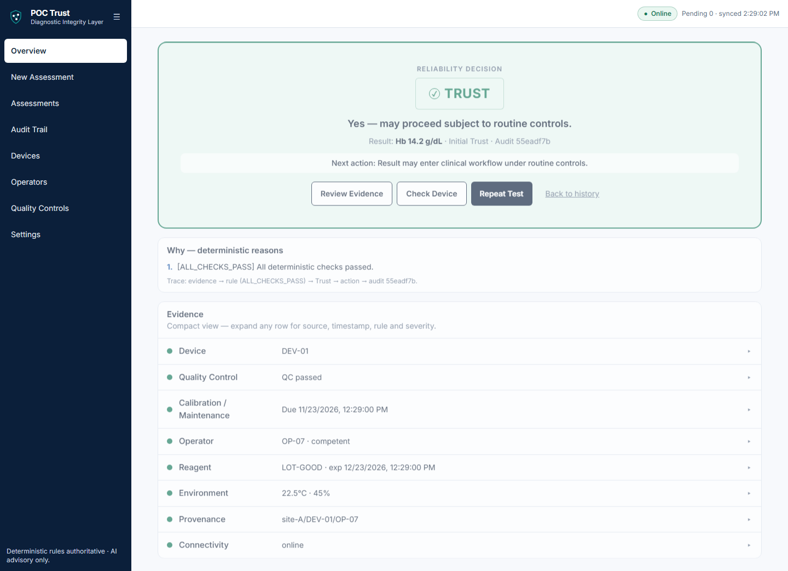
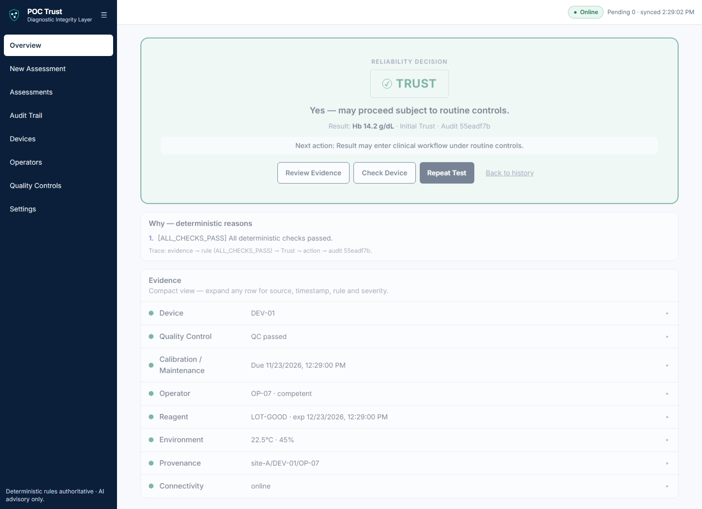
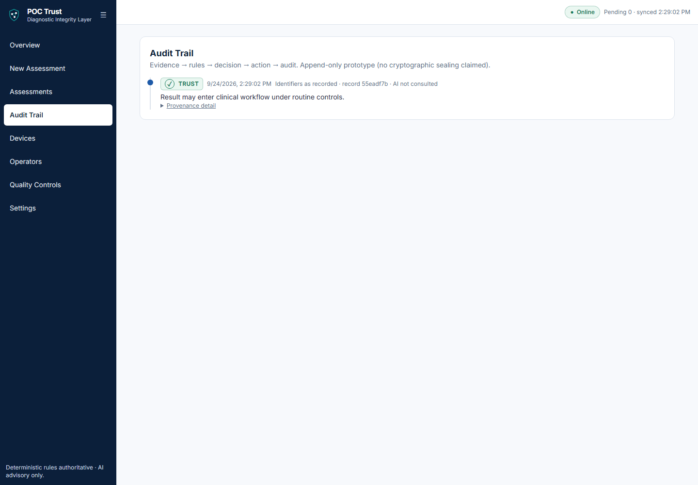

## REVIEW + Contextual Analysis

Interacting concerns (calibration near due, reagent near expiry, operator not competent, power
interruption → `MULTI_CONTEXT`) → deterministic REVIEW **and** the AI gate opens.

**Live Gemini path verified (24 Sep 2026)**, not the stub:

- `POST /api/assessments/evaluate` → **HTTP 200 in 4.05 s**, `aiConsulted=true`,
  `model=gemini-3.5-flash`, 114-char summary returned;
- deterministic reasons all retained; **final status stayed REVIEW** (advisory only);
- audit row recorded AI consultation; stored summary byte-identical to the live response;
- no confidence/model fabricated for stored records (by design).

Configuration that made it work (README-documented, machine-local user-secrets):

```
dotnet user-secrets --project src/POCTrust.Api set "AI:ApiKey"  "<gemini key>"
dotnet user-secrets --project src/POCTrust.Api set "AI:Endpoint" "https://generativelanguage.googleapis.com/v1beta/openai/chat/completions"
dotnet user-secrets --project src/POCTrust.Api set "AI:Model"    "gemini-3.5-flash"
```

Through the actual browser UI: REVIEW decision + 5 deterministic reasons + "AI contextual
assessment consulted." + Contextual Analysis panel rendered; reopen keeps the advisory summary
with the honest note *"no confidence score or model name was persisted"*; audit row shows
`AI consulted`.


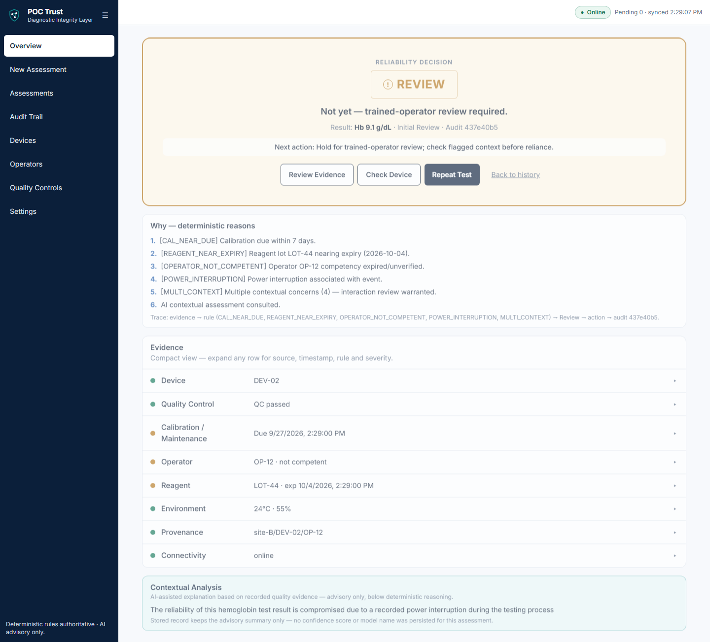
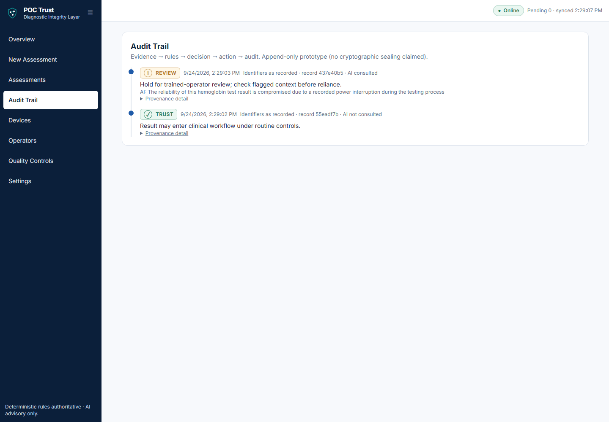
## VERIFY safety behaviour

Hard failures (failed QC + calibration overdue + reagent expired + temp 31.5 °C + humidity 90 %)
→ deterministic VERIFY with **no AI consultation at all** (the gate is closed for VERIFY by
design, so no downgrade path can even be exercised).

- Headline: "No, do not rely on this result alone." + "Do not rely on this result alone."
- Action: "Do not rely, verify/repeat/confirm per applicable workflow."
- No Contextual Analysis panel is rendered; reasons are purely deterministic
  (`QC_FAILED, CAL_EXPIRED, REAGENT_EXPIRED, ENV_TEMP, ENV_HUMIDITY`).
- Reopen keeps VERIFY and still no AI; audit row reads `AI not consulted`.

Verified invariant (unit + live): `EnforceFinalStatus(Verify, _) == Verify` for **any** AI input,
including an AI response that claims TRUST.

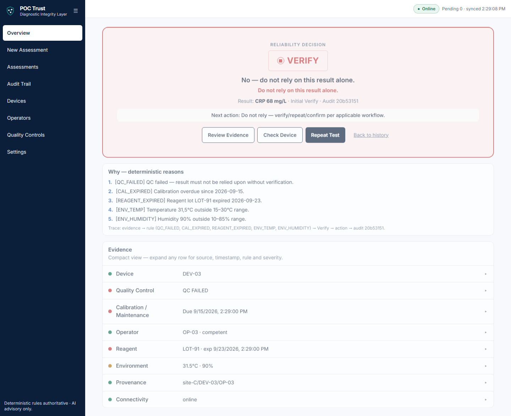
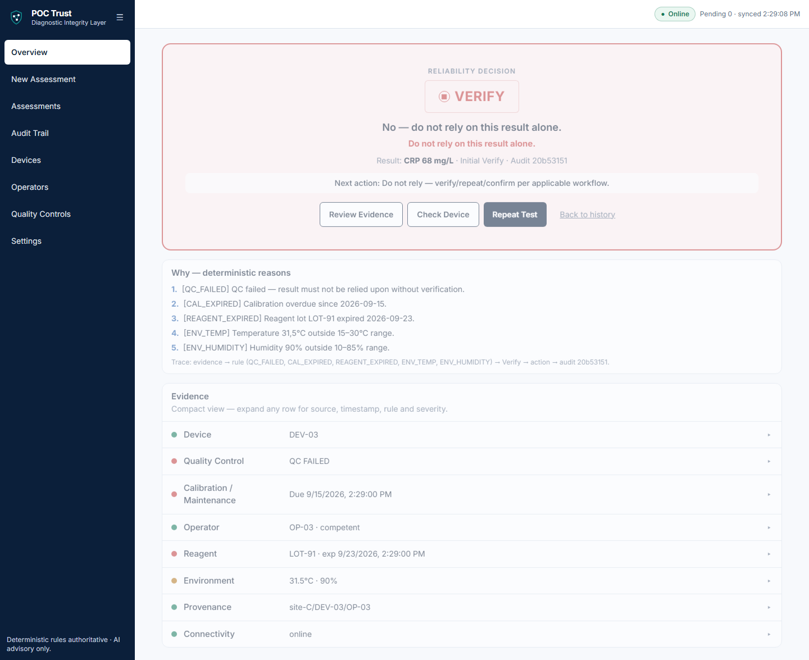

## Evidence / provenance

Every decision page renders the evidence panel the backend actually evaluated, device, QC,
calibration, operator, reagent, environment, power, connectivity, provenance, each row
expandable to source/rule/severity, plus the trace line
`evidence → rule (…) → status → action → audit <id>`. Provenance is treated as a rule
(`PROVENANCE_INCOMPLETE`), not decoration. The UI never claims identity verification
("recorded as claimed") and never invents AI metadata for stored records.

## Audit trail

Append-only SQLite audit: one row per decision, linked by `assessmentId`, carrying input JSON,
initial/final status, action, AI-consulted flag and advisory summary. The Audit Trail page shows
evidence → rules → decision → action with per-record provenance detail. Verified live for all
scenarios: TRUST (`AI not consulted`), REVIEW (`AI consulted` + summary), VERIFY
(`AI not consulted`), offline-synced record.

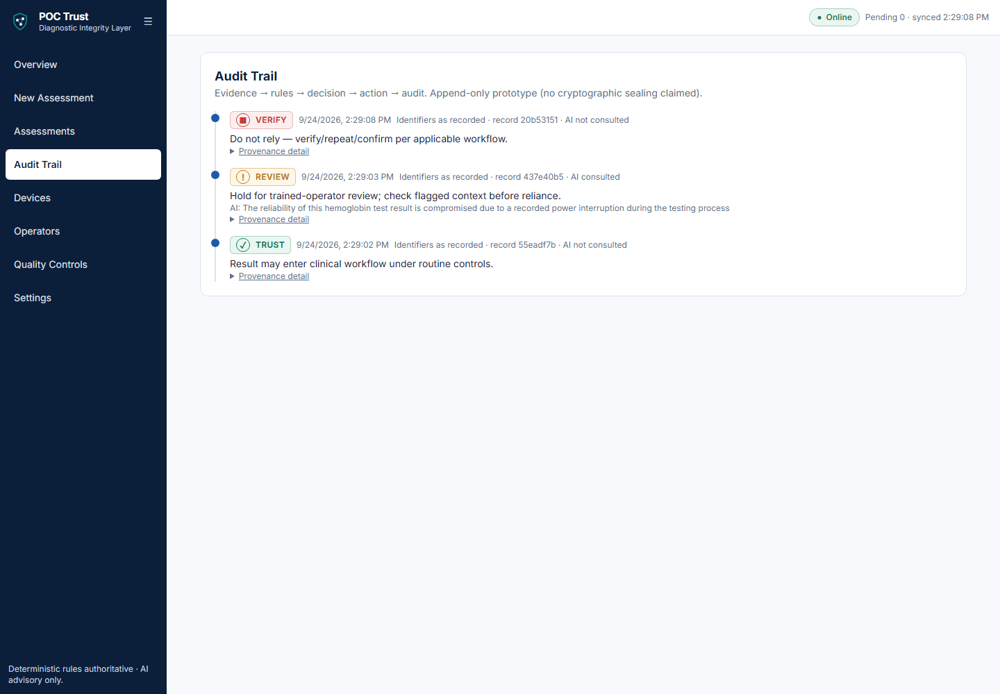

## Offline / low-bandwidth boundary

Honest prototype boundary: the offline path **still requires the real engine**, there is no
local decision-making. With the backend disconnected, a submitted event is **queued in
localStorage** (`Pending 1`), survives a browser reload, is not persisted, and after reconnect
`Sync now` posts it (`Pending 0`) where it persists with `connectivity=offline` metadata.
Connectivity itself is **not** a reliability rule (documented in-product).

Caveat recorded honestly: the queue triggers on *network-level* failures. Behind an HTTP proxy
that converts a dead backend into `502` (e.g. the Vite dev proxy), the app surfaces the server
error instead of queueing, by design it never queues requests the backend actually answered.
A true network failure (browser/API origin unreachable), which is what the deployed static
front-end experiences, queues correctly. This was exercised both ways in the smoke test.

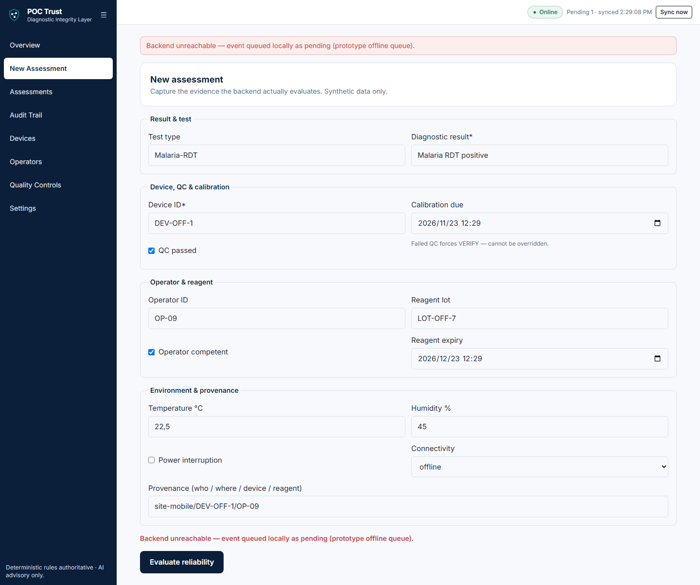
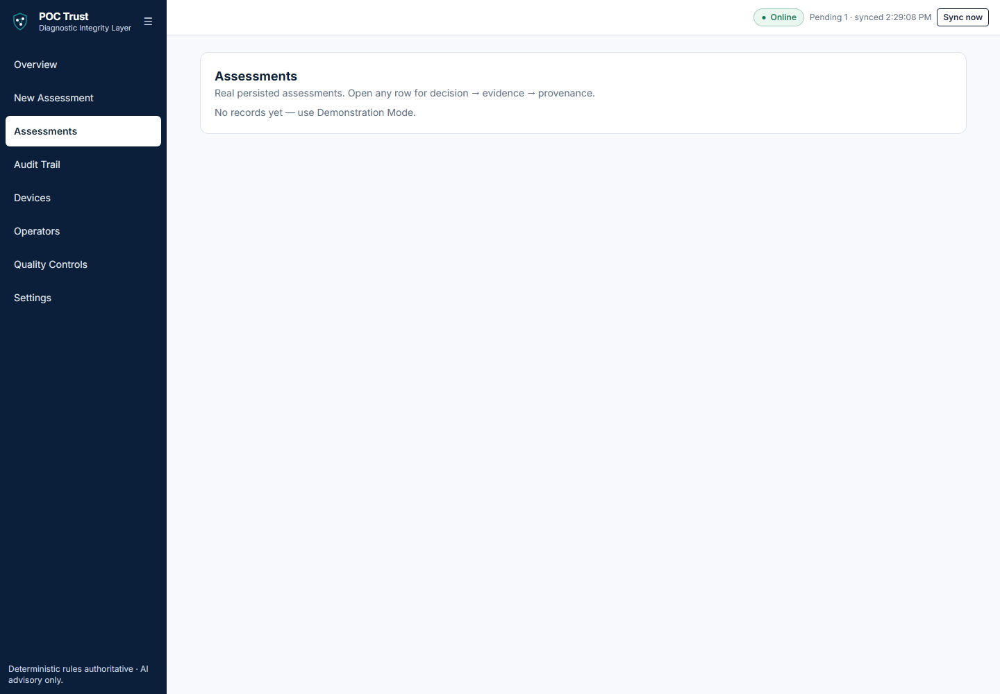
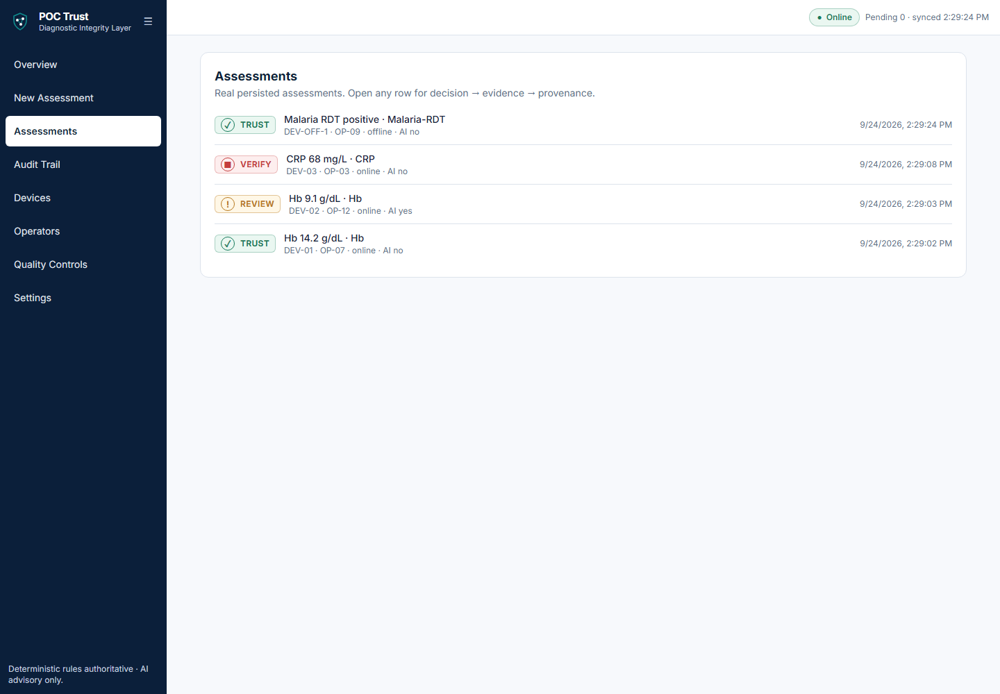

## Security / AI architecture

- **Deterministic authority**: AI cannot set, change or upgrade any status; VERIFY is locked in
  code (`EnforceFinalStatus`), AI is consulted only for REVIEW-level findings.
- **Prompt discipline**: the provider prompt forbids diagnoses and instructs the model not to
  output TRUST/REVIEW/VERIFY as its decision; responses under 40 chars are rejected as fragments.
- **AI keys never reach the client**: backend `dotnet user-secrets` / env only; the Settings page
  explicitly refuses key entry; repo `appsettings.json` ships an empty key and a default endpoint.
- **Safe error contract**: `400 {"error","fields"}` / generic envelopes, no stack traces, paths
  or binder internals; malformed JSON handled explicitly.
- **No secrets in git** (scan clean); SQLite file is local-only; CORS limited to the dev origin.
- Known security debt: no authentication/authorization, no cryptographic audit sealing,
  no rate limiting, recorded below, not hidden.

## Current limitations / TRL honesty

Prototype ≈ **TRL 5–6** (lab-validated, integrated, not field-deployed). Deliberately unhidden:

1. No server-side idempotency key, a replayed sync can create a duplicate assessment.
2. No offline deterministic engine, queued events are stored, never decided locally.
3. In-memory list ordering, history/audit pages sort after fetching (fine at prototype scale).
4. No HTTP integration-test suite, API covered by unit tests + live acceptance scripts (24/24),
   frontend by contract checks + the 41-check browser smoke run; no Testcontainers/end-to-end
   suite in CI.
5. Proxy-translated backend failure surfaces as HTTP error rather than queue (see offline caveat).
6. No authN/Z, roles, rate limiting, or audit sealing (FUTURE in README).
7. SQLite single-writer local storage; no LIS/NHLS integration.
8. Synthetic inputs only; **no clinical validation, regulatory approval or real patient outcomes
   are claimed anywhere in the product or this pack.**

## Suggested demo narrative, "Can this result be trusted?"

1. **TRUST**, clean evidence passes; nothing is hidden: reasons, evidence, audit id.
2. **REVIEW**, context turns against the result; deterministic reasons first, then Gemini's
   Contextual Analysis as *explanation*, and the status **stays** REVIEW (advisory AI).
3. **VERIFY**, hard stop; the AI is not even consulted; the result cannot re-enter the workflow.
4. Finish on Audit Trail: evidence → rules → decision → action → audit, for all three.

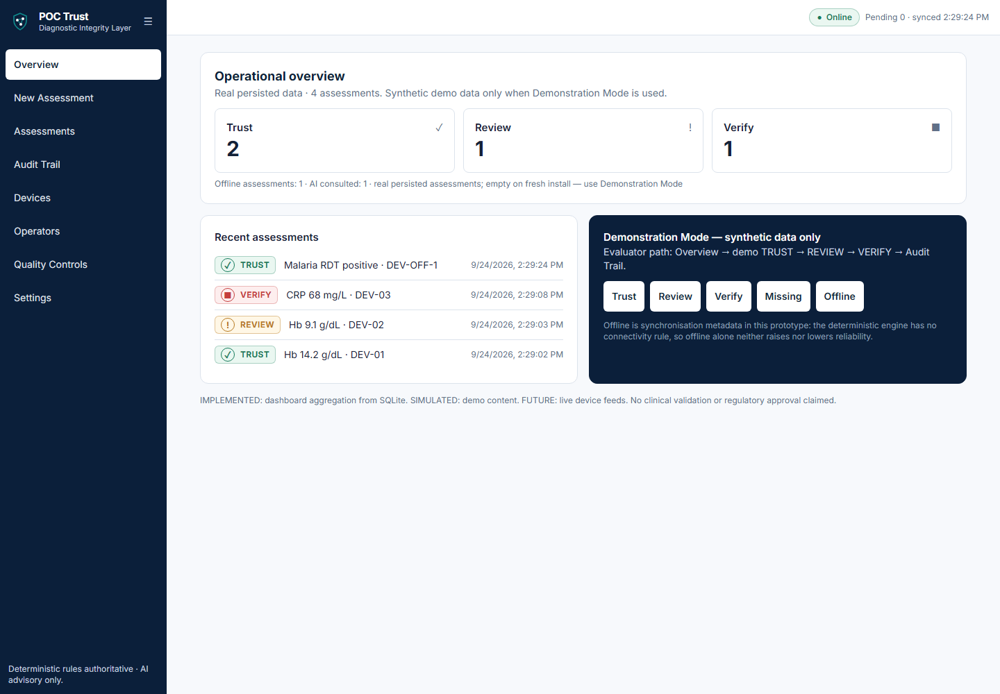

